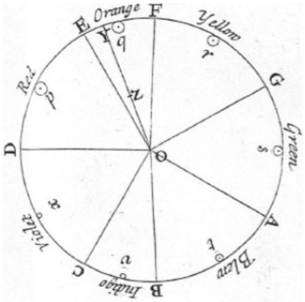
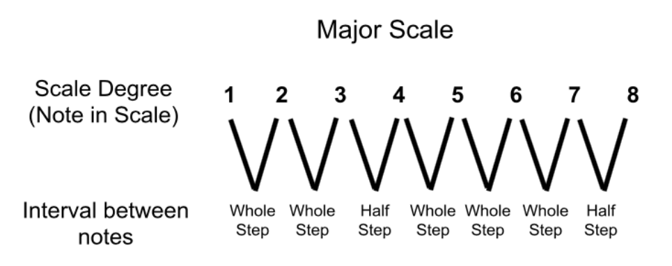
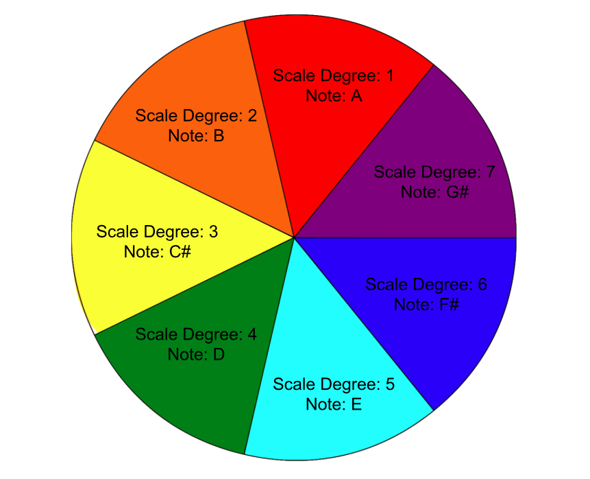
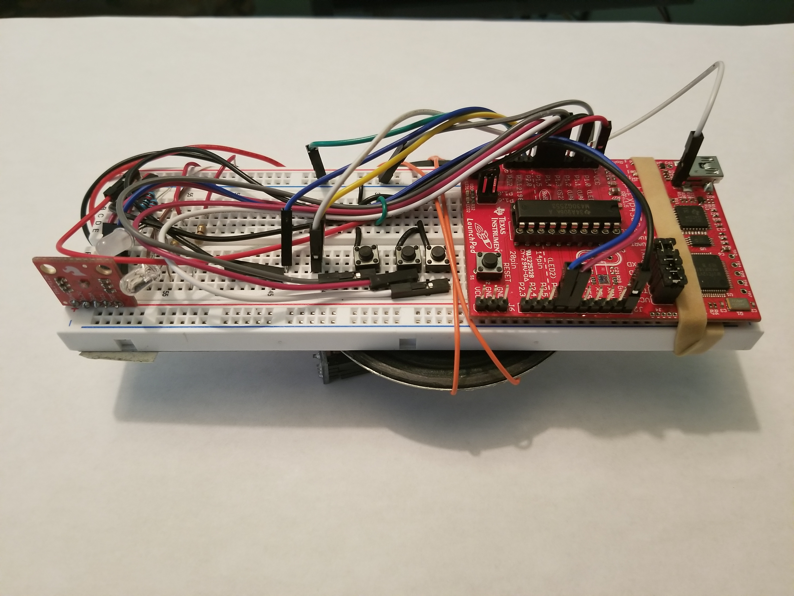
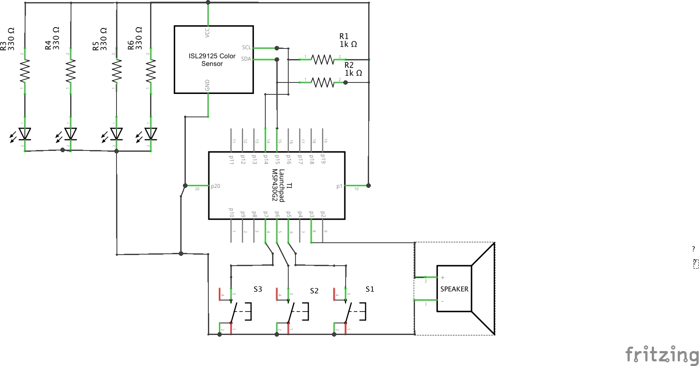
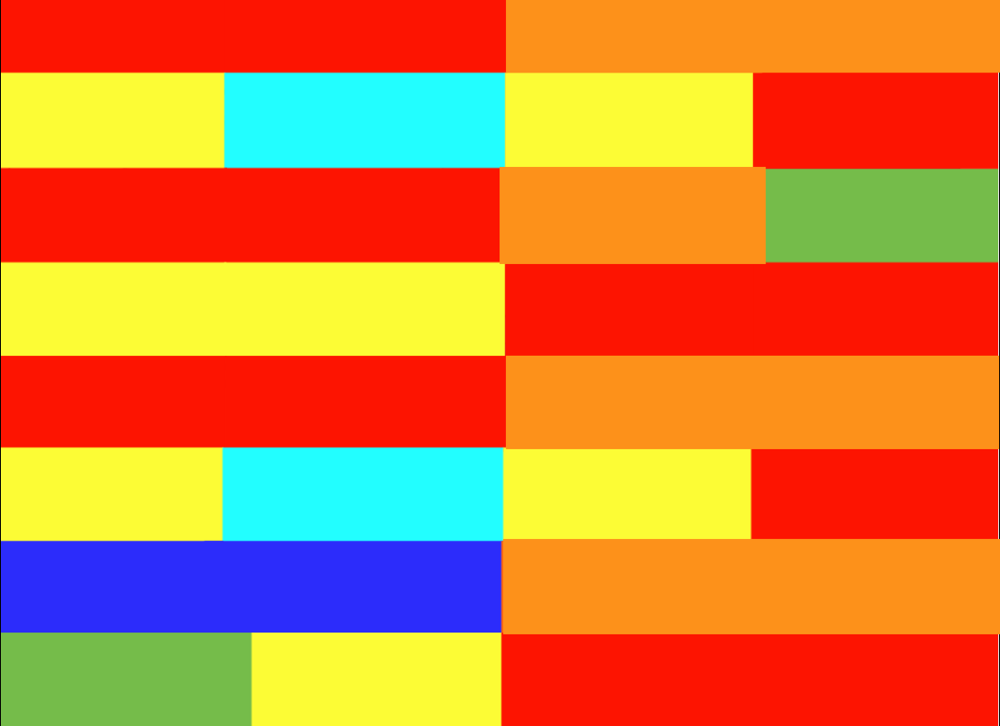
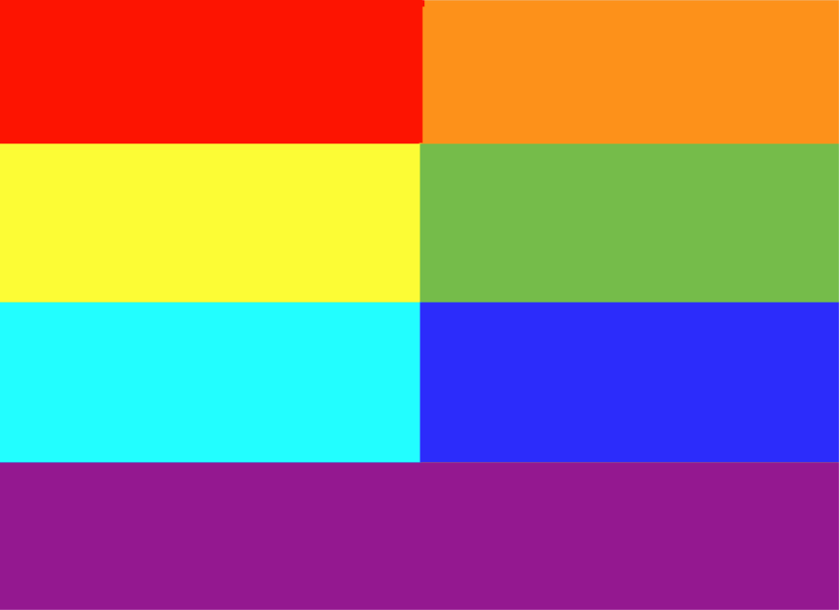

# Synth-esthesia

## Abstract / Introduction
Synesthesia is a neurological phenomenon where different sensory pathways activate simultaneously.  An example of this is when someone interprets numbers as colors, letters as colors or colors as musical tones.  Many artists and musicians, such as Jimi Hendrix, were known to have experienced some form of synesthesia.  This condition is documented as R44.8 in the 10th revision of the International Statistical Classification of Diseases (ICD-10).  
This project aims at simulating this phenomena for users to experience.  With microprocessing and sensors becoming  smaller and cheaper, pocket computation is more powerful and accessible than ever.  Synth-esthesia will translate the visual color spectrum into an audible pitch range.  
## I	General Overview
Synth-esthesia is a device which translates color into pitch.  The color is detected by the ISL29125 Color Sensor.  The sensor outputs a red value, green value, and a blue value.  The MSP430G2553 microcontroller by TI receives the updated RGB color values.  An algorithm determines the specific color using these RGB color values.  Each color is assigned a pitch frequency, which can be altered using the octave up and octave down buttons.  Finally this audible frequency can be triggered by pressing the note activation button.  These are the only  three external buttons which control Synth-esthesia.  The attached speaker outputs the calculated pitch.  The result is a device that can translate color waves into sound waves.  Paintings and pictures can be listened to and songs can be visually admired.   
## II	Previous Research
Mathematicians over the centuries have searched and found many correlations between different natural phenomena.  In 1665, Sir Isaac Newton created a color wheel based on his color theory.  The wheel was divided into seven sections, similar to a pie graph.  Each section was assigned a color from the visible spectrum i.e. red, orange, yellow, green, blue, indigo, violet.  The range of this spectrum can be observed by projecting white light through a prism.  What makes Newton’s color wheel unique is the addition of a musical note to each division. 

#### Figure 1: Newton’s 1665 color wheel
Newton assigned the color red to be the note D.  If we follow the notes from red through violet we get D, E, F, G, A, B, C.  This sequence of notes is known as the D dorian mode.  
## III	Music/Color Theory
Music can be abstractly thought of as the organization of waves through time.  The rules and standards behind this organization is known as music theory.  A musical note, or pitch, can be scientifically measured as the number of oscillations or frequency.  The unit Hertz is defined as the number of oscillations per second.  The current standard for the note A is 440 Hz.  When we multiply this frequency by two, the result is the same note but one octave higher.  So 880 Hertz is exactly one octave higher than 440 Hertz.  This mathematical conversion is carried out when the octave up button is pressed.  Adversely, dividing the frequency in half will result in the same note, but one octave lower.  220 Hertz is one octave lower than 440 Hertz.  This mathematical conversion is carried out when the octave down button is pressed.  Western music theory divides the musical octave into twelve equal subsections.  Each subsection is consider to be a half-step interval.  As expected, two half-steps equal one whole-step.
This brings us to the organization of musical scales.  A standard musical scale consists of eight notes.  The eighth note in the scale is the same as the first, but one octave higher. These eight notes will be in a proximity of a half or whole step away from each other.  A major scale has the consecutive note intervals of whole step, whole step, half step, whole step, whole step, whole step, half step. 

#### Figure 2: Major scale note intervals
The number of notes per scale is essential to the translation that the MSP430G2553 will calculate.  Since the eighth note is the same as the first note, each scale has seven unique notes.  This means we can translate these pitches onto seven unique subsections of the color spectrum.  The traditional Newtonian color wheel included indigo and violet, however for these can be concatenated for my project.  Teal was added as a subsection between green and blue.  So the Synth-esthesia color range is red, orange, yellow, green, teal, blue and violet.  The color to pitch conversion can be viewed in Figure 3.

#### Figure 3: Synth-esthesia color to pitch conversion chart

## IV	MSP430G2553
The Texas Instrument MSP430G2 series microcontrollers are ready to program right out of the box.  However, if a project requires a hardware serial connection, then a few alterations to the board must be made.  First, the TX and RX jumpers in the J3 quadrant must be connected parallel to the dotted line printed on the PCB.  This ensures that hardware serial is activated on the MSP430G2553 Launchpad.  Second, the jumper wire for LED2 at P1.6 should be removed from J5.  If the jumper is not removed, the port P1.6 will not function properly. This port is necessary for implementing I2c protocol with the MSP430G2553 launchpad in particular.  Port P1.6 is the clock pulse data and port P1.7 is the data signal pin for I2c.

## V	ISL29125
The color is sensed by the ISL29125 color sensor by Sparkfun.  The sensor implements an array of photoresistors with red, green and blue transparent light filters.  As a color is reflected into the photoresistors, the resistances begin to change.  With the sensor’s supply voltage of 3.3 volts, we can measure these variations in resistance.  These values then run through the ISL29125’s onboard analog-to-digital converter or ADC.  These freshly converted digital values are then stored in reserved registers for the colors values.  There are six byte-sized registers total to represent three color values i.e., red low byte, red high byte, green low byte, green high byte, blue low byte and blue high byte. The I2C protocol will read these six registers, one bit at a time.  At the rising edge of each clock pulse, the ISL29125 will sequentially push a single bit from the color registers to the MSP430.  This will continue until all six registers are read.  Then the red, green and blue high bytes are shifted and ORed with their individual low bytes.  Each of the three colors will now be represented as a 16-bit hexadecimal number.

## VI	Value of Device
Synth-esthesia in educational atmospheres can teach students the correlation between waves in the electromagnetic spectrum.  Visual artists can utilize the alternative avenue to experience their work.  Even musicians can have an alternative interface to create music using Synth-esthesia.   
Color vision deficiency, commonly known as color blindness, is a medical condition where certain colors cannot be individually distinguished.  Now, with Synth-esthesia there an alternative way to experience these colors.

### Breadboard for Synth-esthesia:

### Synth-esthesia Demo Link:
https://www.youtube.com/watch?v=15f6C21gZDQ

## VII	Schematic
  
*Note that the three buttons are active low with an internal pull-up resistor
## VIII	Flowchart
	

## IX	Musical Transcriptions 
 
The figure above is the song “Pop goes the Weasel” transcribed for Synth-esthesia
 
The figure above is the song “Mary had a little lamb” transcribed for Synth-esthesia
 
The figure above a major scale and improvisation palette for Synth-esthesia

## X	References

[1] Taylor, A. (2017). Newton’s Color Theory, ca. 1665. [online] The Scientist Magazine®.   Available at: https://www.the-scientist.com/foundations/newtons-color-theory-ca-1665-31931 [Accessed 28 Jul. 2018].

[2] Learn.adafruit.com. (2018). Code | Flora MIDI Drum Glove | Adafruit Learning System. [online] Available at: https://learn.adafruit.com/midi-drum-glove/code [Accessed 28 Jul. 2018].

	

